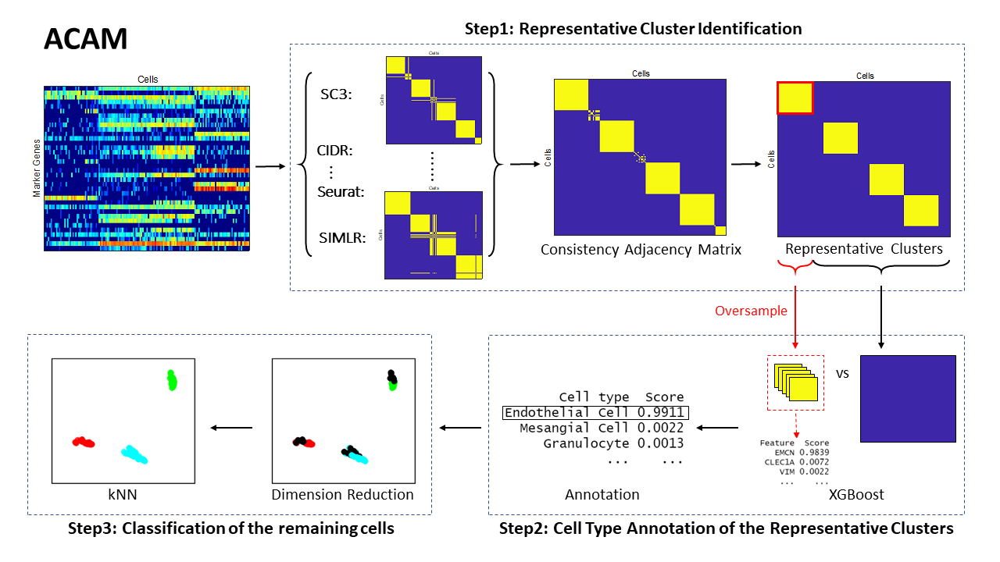
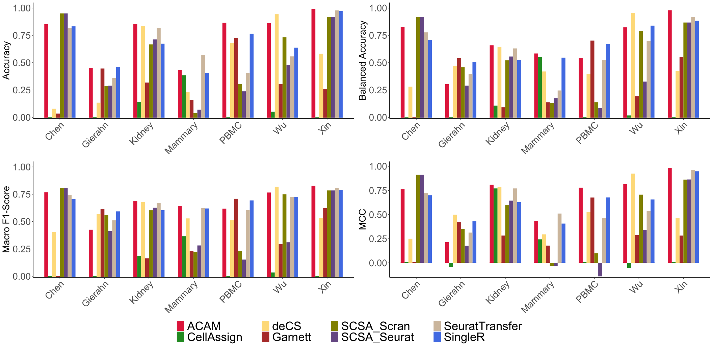
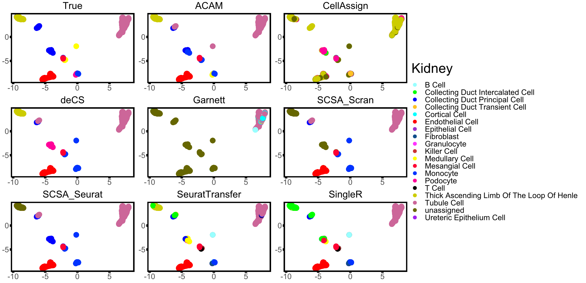
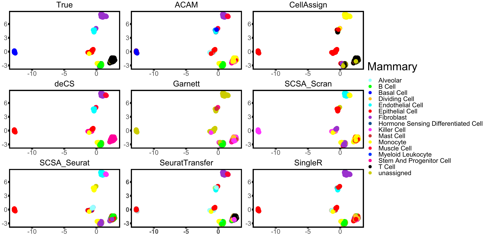
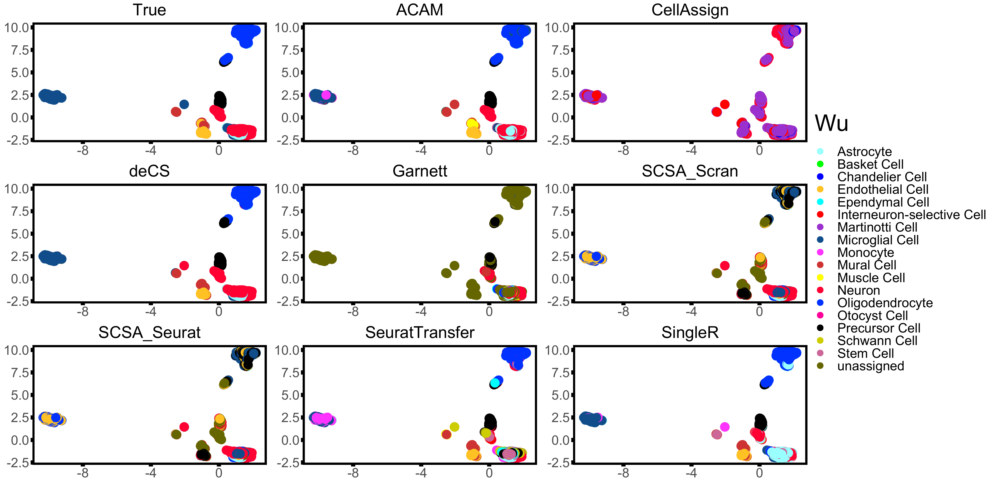

# ACAM
This is the repository of the source code and results of performance comparison of ACAM against Garnett, CellAssign, SingleR, Seurat transferData, deCS and SCSA. If you want to use ACAM, see the package <https://github.com/yuc0824/ACAM>.

# Introduction
Automatic Cell type Annotation Method (`ACAM`) is proposed based on  marker genes'  information. This method first finds the representative clusters by searching for the  consistent subgroups across the  results  of  several popular clustering methods.  Such technique guarantees that the cells in the same cluster have very high probabilities of being from  the same cell type. Then by selecting the  features that  discriminate  one cluster from all the remaining cells,  the potential marker genes  are identified. The cell types are determined by defining a cell type importance score to match these marker genes with the validated ones.  For those cells that do not belong to any of these clusters, we use $k$-nearest neighbors to determine their cell type. 

# Notes

- <>
- Markers of different forms to cater for the use of different methods. They are given in the fold begin with markers.
- In the fold [results](./results/):
  - 'Y_xxx.raw': The original labels.
  - 'Y_xxx': The numeric form of 'Y_xxx.raw'.
  - 'xxx.comb': Clustering results for checking convenience, since the time cost of clustering may be long.
  - 'umap_xxx': The umap dimensional reduction form of the data.
  - 'cds1_xxx', 'Y_xxx_cellassign', 'Y_xxx_singleR', 'xxx.predictions','deCS_xxx','SCSA_seurat_xxx','SCSA_scran_xxx': comparison results of Garnett, CellAssign, SingleR, Seurat transferData, deCS, SCSA_seurat and SCSA_scran respectively.
- Consensus tables of cell types and numbers between 'Y_xxx.raw' and 'Y_xxx' are in the fold [celltype](./celltype/) for some dataset needed.

- Figures of the flowchart and visualizations are in the fold [vignettes](./vignettes/).

# Comparison results and visualizations
Annotation performance comparison. Results of the  compared methods using four evaluation metrics: Accuracy, Balanced Accuracy, Macro F1-Score and MCC on seven real-world datasets are shown.

Rank of the eight methods. The performance rank of each method  according to four performance metrics: Accuracy, Balanced Accuracy, Macro F1-Score and MCC on seven datasets is shown.  Lower rank represents better performance (one is the best and eight is the worst).

Two-dimensional visualization of the annotation results for dataset Kidney using UMAP.

Two-dimensional visualization of the annotation results for dataset  Kidney using UMAP.

Two-dimensional visualization of the annotation results for dataset  Kidney using UMAP.

